# Project Captcha: Captcha The Hill!

 

    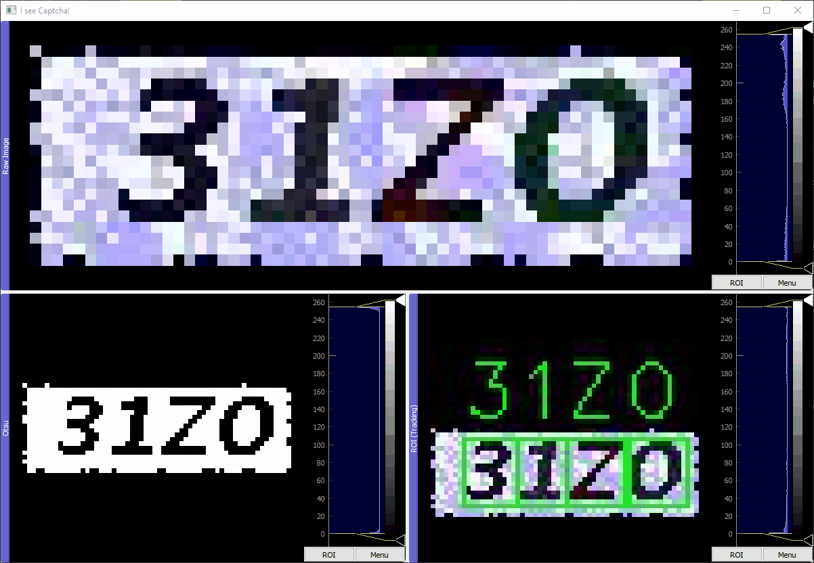

 

The objective of *project captcha* is three-fold: solving simple captchas that
are generated from a real system (albeit ancient), learning more about 
neural networks for my own interest, and writing a guide for those who have 
just started doing data science and/or neural networks.

Above is a summary animation of the results of this project: The top 
window is the raw captcha, the bottom left window is the captcha with Otsu's 
algorithm applied, and the bottom right window is the solved captcha with 
letter tracking.

In short, the method used here to solve the captchas was to split the captcha
images into single letters, and then solve for each individual letter using a 
convolution neural network (CNN). For those interested in the low level details 
and a bit of a guide, see below [(Part 0: Introduction)](#part-0-introduction).

## Part 0: Introduction
Sometimes learning about the thought process involved is more important than 
the solution itself; this guide is tailored for those who have just begun 
exploring data science and/or neural networks. My small hope is to encourage 
those people since at the time of this writing I am one of them. I am *not* 
by any means a qualified data scientist nor do I claim to be, however, I 
am a believer in that going through the struggles of someone who has just 
started is entertaining (that sounds rather mean) and useful in its own right.

##### Table of Contents:

0. [Part 0: Introduction](#part-0-introduction)
1. [Part 1: Analysing the Problem](#part-1-analysing-the-problem-four-step-plan)
2. [Part 2: Studying the Data](#part-2-studying-the-data)
3. [Part 3: Labelling the Data](#part-3-labelling-the-data)
4. [Part 4: Recycling Old Code](#part-4-recycling-old-code)
5. [Part 5: Letter Detection Algorithm](#part-5-letter-detection-algorithm-step-1--step-2)
6. [Part 6: Neural Networks](#part-6-neural-network-step-3--step-4)
7. [Part 7: Conclusion](#part-7-conclusion)

## Part 1: Analysing the Problem (Four Step Plan)
Let's sketch out the problem. My problem statement boils down to a single 
line: 
    
    "Given a captcha image, return the letters contained in that captcha."

*But how?* Well, do we know of any system that can solve these captchas 
already? Yes! Humans! It would be reasonable at this point to ask our humans 
friends for 'inspiration'. How would a human solve this captcha? Breaking those 
steps down would be a good start. What do these captchas even look like?

 

    

 

So as human, how would we solve the captcha above? (yes its blurry because 
the original image is a tiny 20x60 pixels) The steps I would take for instance:

    1. I see a red background that looks rather useless so I would ignore it.
    2. I see four distinct letters in black and would assume the captcha is only four letters.
    3. Going from left to right, the letters look like '0' (or maybe 'O' if the font is potato?), '1', 'Z', 'U'. 
    4. So the captcha is '01ZU'!

Alright, this is great. We now have a simple algorithm to solve these 
captchas. This algorithm is good enough for other humans to use (although by my 
standards this is completely unacceptable; where are the details man?!) but 
what about for our machine friends? Would they understand what 'ignoring' 
the background is? Can they distinguish between '0' and 'O'? Do they 
even know what an '0' even is? Let's break down our algorithm into more details
to help our machine friends (and some human friends too).

#### Step 1

    1. I see a red background that looks rather useless so I would ignore it.
      1.1 Remove any pixel that has a good degree of red or white in it.

Using GIMP (similar to Photoshop but open source), we would remove the 
red background and have a black and white image like the one below. We can use 
this new image in the next step.

 

    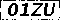

 

#### Step 2

    2. I see four distinct letters in black and would assume the captcha is only four letters.
      2.1 From our black and white image (step 1.1), I can extract four black regions that represent four letters.
   
In the previous black and white image, we can see four black regions that so 
happen to map onto four letters. Let us 'extract' those four black regions 
(see below). All that is left now is to find what each letter is per block!

 

    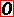
    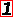
    
    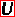

 

#### Step 3

    3. Going from left to right, the letters look like '0' (or maybe 'O' if the font is potato?), '1', 'Z', 'U'. 
        3.1 Using my brains limited memory capacity, I am doing a simple pattern matching.
        
For *step 3.1*, the pattern matching that the brain does is actually rather 
complex and you will see why once we implement the neural network! Though for 
*step 3* as a whole, we are doing some pattern matching and there various 
approaches here (e.g. neural networks, template matching, key feature 
matching) however we will only explore neural networks in this guide even 
though later we will see the limitations of neural networks for this dataset.

#### Step 4

    4. So the captcha is '01ZU'!
    
Just glue all the letters we guessed from *step 3.1* together from left to 
right and viola!

This is great, we should now have a much better idea of how to implement our 
solution. We have some keywords and topics we can now Google as well to learn 
more of the lower level implementation details. I would highly recommend to 
check out the guides mentioned in [credits](#credits) of which this guide is 
heavily inspired by including direct code snippets.

## Part 2: Studying the Data
Now we can dip our hands into some data. At this point, I just headed to the 
data directory, opened ImageGlass (alternative to Windows Photos), and 
shuffled back and forth between various images to get a feel of how the data 
is 'structured'.

 

    
    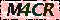
    

 

Some of my observations were:

1. The captchas are always 20x60 pixels.
2. The red background is not static and changes every time.
3. The letters are uniformly spaced but vary (and sometimes get merged).
4. The same exact font for each captcha (e.g. see the 'R' letter above in both captchas)
5. There is 3 pixels of spacing above and below (except for letter J which I found out later!)

Bullet point 4 is rather interesting. This means that we don't even need to 
use neural networks for this problem! We can just store the images of each 
letter as templates, and then do some form of sliding of these templates
across the captcha until a perfect match is found. But no! Neural networks or
 nothing! So let us move on.
 
Bullet point 2 implies that we can't just subtract a static background image 
from the captchas, rather, we will have to do something more clever like 
thresholding some pixel values.

Bullet point 3 is an indication of imminent pain. We can't extract the 
letters by just uniformly splitting our captcha. We will want to do something
 more clever like extracting of contours.

## Part 3: Labelling the Data
At this point I should mention that while I happily obtained 10k captcha 
images, it went over my head that I would have to manually label these 
captchas with the solutions, since the neural network we are going to build uses
supervised learning (we need to teach it what the correct answer is first!).

The amount of data we have exactly is 10k x 4 letters = 40k letters. The 
captchas seem rather simple so perhaps we need not much data to train our 
network. How much is enough? When I get tired of labelling. Actually, I'm not 
even the one labelling, I have empowered a member of my household to do this 
dutiful task.

Now we have 500 labelled captchas to start with. If we need more, we can come
 back to labelling them (well... get someone else to do the dirty work...).

## Part 4: Recycling Old Code
To implement our four step plan from [part 1](#part-1-analysing-the-problem),
we need to code two major components: an algorithm to extract letters (this 
would involve [step 1](#step-1) and [step 2](#step-2) of the plan), and a neural 
network to feed the extracted letters (this would involve [step 3](#step-3) and 
[step 4](#step-4)).

For letter extraction algorithm, I decided it was a good day to recycle some 
code that I wrote two [two years ago](https://github.com/OthmanEmpire/project_elegance). 
The idea was to use a ready GUI interface (see the GIF at the start) and a 
tracking algorithm that would need little modification to do letter extraction. 
The incentive was that it would save time. It was a good incentive...

I had a fight with the docstrings, the awkward IO class, the funny naming 
conventions, and truth be told, the code I wrote 2 years ago surprisingly 
wasn't bad at all, but my slight OCD to refactor code kicked in and... no time 
was saved, only lost.

## Part 5: Letter Detection Algorithm (Step 1 & Step 2)
Now it is time to actually implement [step 1](#step-1) and [step 2](#step-2) of 
our plan, the letter detection algorithm. 

#### Step 1 (implementation)

    1. I see a red background that looks rather useless so I would ignore it.
      1.1 Remove any pixel that has a good degree of red or white in it.
      
To filter out the noisy background, we need to define exactly what is 
considered noise. As before, diving into GIMP and analysing the image should 
prove to be fruitful. Converting the image to grayscale and then analysing 
the histogram of pixel values (features of GIMP), we see that there is a clean 
separation between noise and useful data (see below). So it would be safe to 
say our letter detection algorithm should convert a captcha image to 
grayscale, then extract pixel values of 127 to 255 for any captcha.

 

    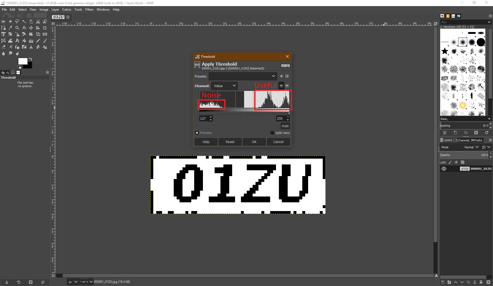

 

#### Step 2 (implementation)
      
    2. I see four distinct letters in black and would assume the captcha is only four letters.
      2.1 From our black and white image (step 1.1), I can extract four black regions that represent four letters.
      
Now to extract the letters themselves, since they are not uniformly spaced as 
noted beore, we can use OpenCV's contour detection algorithm in Python. 
Simply put, a contour is a curve that encompasses pixels of the same value, 
and in our case, the image like the one above should only have two colours 
(black and white), so our contours should be black regions that map onto a 
letter.
 
Studying the letters again, the smallest sized letter (and consequently 
contour) would be 'I' (13x4 pixels) and largest it seems would be 'W' (13x13 
pixels). We can use this information. In our OpenCV contour algorithm, 
`cv2.findContours` function, let us ignore any contours that are smaller than 
the letter 'I' and larger than 'W'. If we run our algorithm now, it works great 
for most captchas but it breaks for some captchas:
 
 

    
    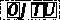
    

 

What's going on here? Let's look case by case. For the 1st captcha, 'OM4' is 
not even detected! Notice that the letters are merged... Wait, this violates a 
recent assumption of ours! If letters are merged, the largest contour size is 
no longer 'W' (13x13 pixels), but it would be four 'W' letters stuck together 
which is 13 x 13 x 4 pixels.

 

    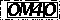

 

That is much better, though there is still an issue. 'OM4' is treated as one 
big contour. A solution to fix this issue is that if we detect a contour 
that is larger than one letter, say by 25%, then we split that contour 
uniformly into two  smaller contours right in the middle. This approach is 
prone to creating  contours with overlapping regions, but that might be ok, 
we will let our  upcoming neural network handle the issue (though it would be
best to fix it  here but it is too much work for now, we can revisit this 
later if need be).  The same logic can be applied for two, three or even 
four letters joined together. If all fails, for instance in the case when 
you have four 'I' letters joined together (their width would roughly equal 
height), then we can have an if statement that manually slices the captcha 
into four uniform sections if less than four contours are detected (this 
required a lot of trail and error to find optimal slicing!). Not the most 
robust or ideal solution, but it is quick and dirty enough for our needs. 
Implementing this, our results are as follows:

 

    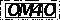

 

Two more cases left to examine:

 

    
    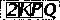

 

Notice that our solution we just implemented is already at work; the merged 
'KP' in the 3rd captcha is now being detected as two separate letters. Great. 
But why isn't the 'J' and 'Q' being recognised? To be frank, I was confused 
at this point so I just shuffled around other captchas with 'J' and 'Q' and 
then noticed a trend... When a letter touches a black pixel that is part of 
the border of the captcha (see all those black pixels at the borders?), this 
letter automatically merges with the contour of the entire border, thus 
making it a super big contour. This is not what we want, we want to isolate 
the captcha border contour from the contour of the letters. A quick fix to 
this issue is to override the border with white pixels (we don't care about 
the border after all). This will ensure separation.

 

    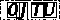
    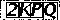

 

At this point, skimming through the output images of our letter detection 
algorithm, our algorithm is more than ready to go. It looks like it works 
well for more than 90-95% cases. Any further improvement is not worth the time 
and can be revisited later. So to recap, our algorithm does the following:

1. Convert the image to grayscale.
2. Filter out the noisy red background by thresholding for pixel values of 127-255.
3. 'Colour' in the border to let the contour extraction algorithm pick up letters like 'J' that touch the borders.
4. Extract contours of black pixels which would map onto letters.
5. Slice contours that are large since most likely they contain multiple letters.

## Part 6: Neural Network (Step 3 & Step 4)
The most exciting part of the entire project. My hopes and dreams, I see them
all. Not that they lasted very long. Despite neural networks being the crux of 
the entire project, this part was the quickest. Building the neural network 
was pretty quick in Python with `Keras` and recycling code from 
[Adam Geitgey](#credits).

#### Step 3 (implementation)

    3. Going from left to right, the letters look like '0' (or maybe 'O' if the font is potato?), '1', 'Z', 'U'. 
        3.1 Using my brains limited memory capacity, I am doing a simple pattern matching.

We've already extracted our letters from the captchas, which are labelled, so
the letter images can be labelled easily too. We have 500 * 4 = 2,000 letters
 worth of training data.
 
Our neural network is going to be a generic convolution neural network:

 

    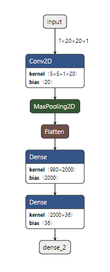

 

Why two convolution layers and not one or three? Trail and error indicates 
that one layer produces better results (about 5-10% accuracy increase in 
solving the captchas). It seems that one convolution layer isn't sufficient 
to capture enough details about the captcha and three makes it capture too 
many unnecessary details.

Playing around with the hidden layer (2nd dense layer in the diagram) doesn't 
do much good either:

        10 Nodes --> 0% accuracy
        15 Nodes --> ~85% accuracy
        20 Nodes --> ~85% accuracy
        50 Nodes --> ~85% accuracy
        100 Nodes --> ~85% accuracy
        500 Nodes --> ~85% accuracy
        1000 Nodes --> ~85% accuracy
        
It looks like anything less than 15 nodes isn't sufficient to express the 
structure of the captchas. For more complex captchas, I would imagine much 
more nodes are needed but we are working with simple ones.

#### Step 4 (implementation)

    4. So the captcha is '01ZU'!
    
Is it though? The accuracy of our convolution neural network (CNN) is about 
85-95%, that is, it solves 85-95% of the captchas correctly. And of the 
cases it failed? How far away from the correct answer was it? Let's examine 
some cases to see ways to improve this:

 

    
    
    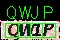
    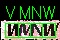
    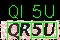

 

From left to right, let us examine case by case.

##### Case 1

 

    

 

Can you spot the error here? None! The solved captcha in green is the same as
the actual captcha. So what went wrong? The human solved solution of the 
captcha is wrong! The filename was mislabelled as "QVAS". Tsk, tsk. Our 
CNN is picking up on my human nature. Next case!

##### Case 2

 

    

 

Here is where we face a real issue. The '0' is being recognised as an 'O' by 
our CNN. How to remedy this? To ensure our training data is not misleading 
our CNN, I quickly delved into the training data which are the images of 
letters extracted from the captchas using our letter detection algorithm.
The training data looked fine, except for a handful of mislabelled cases 
(shouldn't affect our network that much). So the training data is good. 
Perhaps we need to feed it more data of 'O' and '0' so that it learns the 
difference? They look really similar after all. This is left as an exercise 
for another day.

##### Case 3

 

    

 

The captcha 'QW1P' is being recognised as 'QWJP'. Why? The 'W1' are merged, 
and if we flip the image around, the '1' consequently does look like a 'J'. 
One property to keep in mind about CNNs as that they are rotational and 
transitional invariant. So a 'W' would like a 'M', and a 'J' would look like 
a funny merged 'W1'. A solution to combat this is to use the same tactic used
in the card game of Uno: draw a line underneath every letter (e.g. a '9' and
a '6' in Uno are distinguished by just that).

##### Case 4

 

    

 

Our letter detection algorithm hasn't done such a good job here, so the CNN 
consequently couldn't either. What the CNN is seeing is a 'V' and not a 'W' 
because the 'W' has been sliced incorrectly. To solve these type of issues, 
we need to patch up our letter detection algorithm.

##### Case 5

 

    

 

No idea. This one is rather mysterious...

## Part 7: Conclusion
Hopefully you found that journey fruitful. In the end, the best our CNN 
performed was ~95% accuracy which for my purposes is more than sufficient. 

Perhaps CNN was not the best approach as discussed earlier, not because 
better solutions like letter template matching exist for this dataset (the 
letter shapes are always the same so this solution can achieve 100% accuracy
with some quirks involved!), but because this CNN is highly dependant on the 
input from the letter detection algorithm, which has its limitations when it
comes to merged letters. So the CNN's true powers are held back by the previous 
input.

There is room for improvement as discussed in 
[part 6](#part-6-neural-network-step-3--step-4) with some solutions briefly 
discussed, but again, ~95% accuracy is way more than enough for my needs, so 
I will consider this project done and dusted. Now would be a good time to say
this: If there is anything more (or anything less) that you would have liked me 
to mention, please let me know! 
 
Our fleshed out algorithm that we implemented now is:

    1. I see a red background that looks rather useless so I would ignore it.
        1.1 Convert image to grayscale.
        1.2 Threshold for pixel values of 127 to 255.
    2. I see four distinct letters in black and would assume the captcha is only four letters.
        2.1 Fill in the border so the contour extraction algorithm picks up letters like 'J' that touch the border.
        2.2 Extract contours of black pixels which would map onto letters.
        2.3 Slice contours that are large since most likely they contain multiple letters.
    3. Going from left to right, the letters look like '0' (or maybe 'O' if the font is potato?), '1', 'Z', 'U'. 
        3.1 Train our convolutional neural network to build its 'memory'.
        3.2 Feed in the captcha letters one by one and let the CNN classify.
    4. So the captcha is '01ZU'!
        4.1 Validate the output manually.
        4.2 Run on all captchas and measure accuracy.
        4.3 Pick incorrectly solved cases and analyse to improve entire process or give up.
        
        
# Instructions

## How to Use
1. Install all dependencies with `pip install -r requirements.txt`
2. Original data is located in `data/dataset` (10k captchas, 500 labelled).
3. Training data is already unzipped and named appropriately in `data/input`.
4. Navigate to `captcha/main.py` and comment code as need be (e.g. only enable GUI analysis tool).
5. Run `python main.py` from the `captcha` directory.
6. See results in `data/output`.
        
        
## Key Features
- Solves captchas using a convolutional neural network (accuracy 85-90%).
- Allows quick analysis of processed captcha images using a custom GUI tool.
- Contains two core algorithms: captcha letter detection & neural network captcha solver.
- Dumps all processed images in a directory for later analysis (e.g. 'solved_incorrect')

## File Structure

#### Core Logic:
- data.py: responsible for handling IO operations on captcha images
- filter.py: Contains algorithms for analysing captchas (e.g. letter extraction algorithm).
- main.py: Highest level script to run the project.

#### GUI:
- controller.py: contains controller class for the GUI (MVC model)
- gui.py: Contains the GUI tool used to analyse captchas.

#### Neural Networks:
- neural.py: Responsible for training and building the CNN.
- solver.py: Responsible for solving captchas using the trained CNN.

## Credits
1. Adam Geitgey, a beautiful guide and code for solving captchas in 15 minutes with machine learning:
    https://medium.com/@ageitgey/how-to-break-a-captcha-system-in-15-minutes-with-machine-learning-dbebb035a710
    
2. Lutzroeder, NETRON, visualisation of the neural network:
    https://github.com/lutzroeder/Netron
    
3. Marco Radic & Mario Mann, Novatec, another beautiful guide for solving more compelx captachs:
    https://www.novatec-gmbh.de/en/blog/deep-learning-for-end-to-end-captcha-solving/
    
4. Sumit Saha, Towards Data Science, an-indepth guide on CNNs:
    https://towardsdatascience.com/a-comprehensive-guide-to-convolutional-neural-networks-the-eli5-way-3bd2b1164a53
